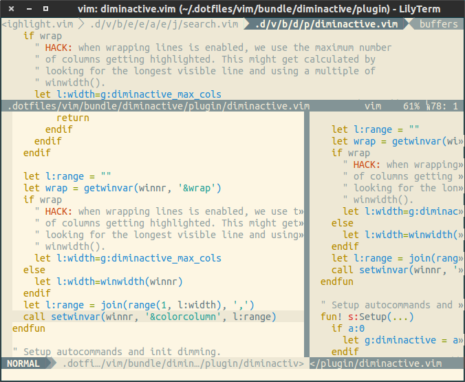

# diminactive.vim

This is a plugin for Vim to dim inactive windows.

## Screenshot

## Screencast

## Methods

It provides two methods, which can be used independent:

### The `colorcolumn` method

With this method `colorcolumn` gets set to a list containing every column for
the inactive windows, effectively resulting in a different background color
(see `hl-CursorColumn`).

This is enabled by default and can be disabled, e.g. if you want to use the
syntax method only:

    let g:diminactive_use_colorcolumn = 0

### Highlighting group

Vim's ColorColumn highlighting group is being used for this, which is red by
default, and pink if undefined):

    :hi ColorColumn
    ColorColumn    xxx term=reverse ctermbg=1 guibg=DarkRed

You can define a custom color yourself, in case your colorscheme does not use
something sensible:

    :hi ColorColumn ctermbg=0 guibg=#eee8d5

### The `syntax` method

There is an option to disable syntax highlighting for inactive windows. It is
disabled by default, and you can enable it using:

    let g:diminactive_use_syntax = 1

### `FocusLost` and `FocusGained` events

You can enable (un)dimming windows on Vim's `FocusLost` and `FocusGained`
events by adding the following line to your `.vimrc` (defaults to 0):

    let g:diminactive_enable_focus = 1

**NOTE**: If you are using tmux it is recommended to install the
[vim-tmux-focus-events][3] plugin for Vim and add `set -g focus-events on`
to your `~/.tmux.conf` to enable better support for Vim's `FocusLost` and
`FocusGained` events in tmux.

## Commands

The following commands are provided to control it:

### Global control
 - DimInactive / DimInactiveOn
 - DimInactiveOff
 - DimInactiveToggle

 - DimInactiveSyntaxOn
 - DimInactiveSyntaxOff

 - DimInactiveColorcolumnOn
 - DimInactiveColorcolumnOff

### Control on the window level
Dimming can be controlled on the window level, which overrides any buffer-local
configuration (a buffer can be displayed in multiple windows).

#### `DimInactiveWindowOff`
Disable for this window.

#### `DimInactiveWindowOn`
Enable for this window.

#### `DimInactiveWindowReset`
Reset config on window level.

### Control on the buffer level
Dimming can be controlled on the buffer level.
This gets overridden by window-local configuration (a buffer can be displayed
in multiple windows).

#### `DimInactiveBufferOff`
Disable for this buffer.

#### `DimInactiveBufferOn`
Enable for this buffer.

#### `DimInactiveBufferReset`
Reset config on buffer level.

## Filtering buffers
The dimming can be disabled for given `buftype` or `filetype` with the
variables above.

### `g:diminactive_buftype_blacklist`
If the `buftype` of the current buffer is in the list, then dimming will be
disabled. Default value:

    let g:diminactive_buftype_blacklist = ['nofile', 'nowrite', 'acwrite', 'quickfix', 'help']

### `g:diminactive_filetype_blacklist`
If the `filetype` of the current buffer is in the list, then dimming will be
disabled. Default value:

    let g:diminactive_filetype_blacklist = ['startify']

## Credits

It is based on an [idea from Paul Isambert][1], which got turned into a
[StackOverflow answer][2] and then into a plugin, incorporating the
suggestions made by joeytwiddle.

## Caveats
* It might slow down redrawing of windows.
* It will only work with lines containing text (i.e. not `~` (non-lines)).

## Related plugins

* The [cursorcross.vim](https://github.com/mtth/cursorcross.vim) plugin
  provides automatic and "refreshingly sane `cursorcolumn` and `cursorline`
  handling".
* The [ZoomWin](http://drchip.org/astronaut/vim/index.html#ZOOMWIN) plugin
  allows to (un-)maximize the current window.
* [goyo.vim](https://github.com/junegunn/goyo.vim) provides distraction-free
  writing in Vim.

[1]: https://groups.google.com/d/msg/vim_use/IJU-Vk-QLJE/xz4hjPjCRBUJ
[2]: http://stackoverflow.com/a/12519572/15690
[3]: https://github.com/tmux-plugins/vim-tmux-focus-events
